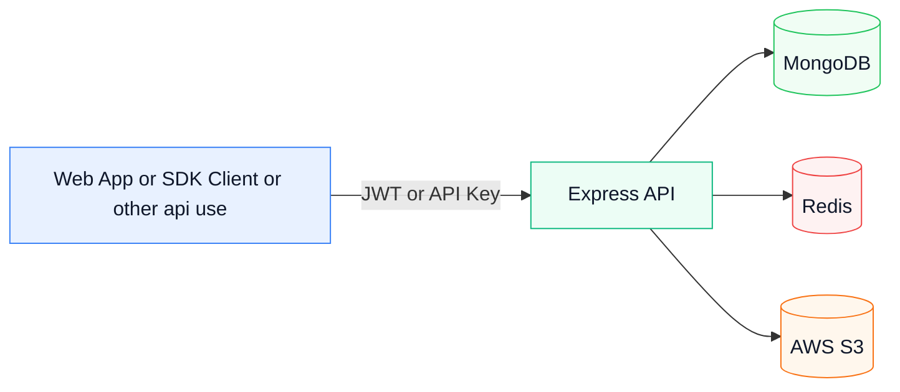
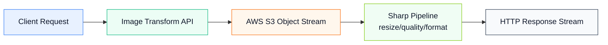
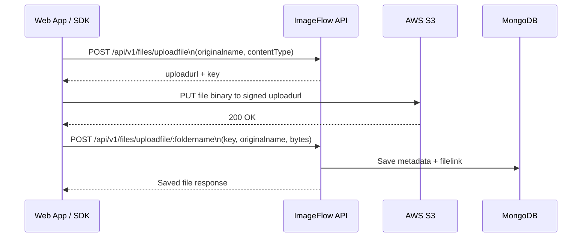

# ImageFlow Backend (ImageKit-like Platform)


ImageFlow is an ImageKit-like media platform backend for users and developers.
It supports:

- User authentication (JWT)
- API key access for developer integrations
- Folder and file management
- Avatar uploads with AWS S3
- File upload workflow with AWS S3 signed URLs
- Image transformations using Sharp stream pipeline

Current status:

- Media transformation API is now available via Sharp.
- Transform pipeline runs as real-time stream processing (S3 stream -> Sharp -> response stream), not blob/buffer in-memory processing.
- Frontend application is currently in progress.
- More platform capabilities and APIs are planned in upcoming updates.

## Who This Is For

- End users: use the ImageFlow website UI to upload and manage files without writing code.
- Developers: integrate with ImageFlow APIs directly or use the provided SDKs.

## Architecture At A Glance

- Backend: Node.js + Express
- Database: MongoDB (Mongoose)
- Cache/Rate Limiting: Redis
- Avatar Storage: AWS S3
- File Uploads: AWS S3 signed URL flow
- Image Transformations: Sharp + stream pipeline
- Auth: JWT + API Key (for protected APIs)



## Base URL And Routing

- Base URL: http://localhost:3000
- API prefix: /api/v1

Route groups:

- /api/v1/users
- /api/v1/folders
- /api/v1/files
- /api/v1/apikey
- /transform

## Authentication

Protected endpoints are validated by a shared auth middleware.

Supported auth methods:

- JWT cookie: accessToken
- JWT header: Authorization: Bearer <jwt>
- API key header: Authorization: Bearer sk_xxxxxx

Important:

- API key management endpoints under /api/v1/apikey are JWT-only.
- API keys are stored hashed (not in raw form).

## API Reference

### Users

| Method | Route                             | Secured | Payload                                                      | Notes                        |
| ------ | --------------------------------- | ------- | ------------------------------------------------------------ | ---------------------------- |
| POST   | /api/v1/users/register            | No      | multipart: fullname, username, email, password, avatar(file) | Create account               |
| POST   | /api/v1/users/login               | No      | email, password                                              | Login rate-limited by Redis  |
| POST   | /api/v1/users/logout              | Yes     | none                                                         | Clears auth cookies          |
| POST   | /api/v1/users/refreshAccessToken  | No\*    | refreshToken cookie                                          | Requires valid refresh token |
| GET    | /api/v1/users/profile             | Yes     | none                                                         | Current user profile         |
| PATCH  | /api/v1/users/updateprofileavatar | Yes     | multipart: avatar(file)                                      | Upload avatar (AWS S3)       |
| POST   | /api/v1/users/updatepassword      | Yes     | oldpassword, newpassword                                     | Change password              |
| PATCH  | /api/v1/users/updateemail         | Yes     | newemail                                                     | Change email                 |

### Folders

| Method | Route                                           | Secured | Payload          | Notes                          |
| ------ | ----------------------------------------------- | ------- | ---------------- | ------------------------------ |
| GET    | /api/v1/folders/getalluserfolders               | Yes     | none             | List current user folders      |
| DELETE | /api/v1/folders/deletefolder/:foldername        | Yes     | foldername param | Delete folder and linked files |
| GET    | /api/v1/folders/getallfilesinfolder/:foldername | Yes     | foldername param | List files for folder          |

### Files

| Method | Route                                | Secured | Payload                              | Notes                                      |
| ------ | ------------------------------------ | ------- | ------------------------------------ | ------------------------------------------ |
| GET    | /api/v1/files/getalluserfiles        | Yes     | query: page, limit, sortby, sorttype | Paginated user files                       |
| POST   | /api/v1/files/uploadfile             | Yes     | JSON: originalname, contentType      | Step 1: create signed S3 upload URL        |
| POST   | /api/v1/files/uploadfile/:foldername | Yes     | JSON: key, originalname, bytes       | Step 2: save file metadata after S3 upload |

### API Keys

| Method | Route                     | Secured   | Payload  | Notes                                 |
| ------ | ------------------------- | --------- | -------- | ------------------------------------- |
| POST   | /api/v1/apikey/create     | Yes (JWT) | name?    | Create API key, raw key returned once |
| GET    | /api/v1/apikey/list       | Yes (JWT) | none     | List keys (without hash)              |
| DELETE | /api/v1/apikey/revoke/:id | Yes (JWT) | id param | Revoke API key                        |

### Image Transform

| Method | Route                | Secured | Payload          | Query Params                   | Notes                                                   |
| ------ | -------------------- | ------- | ---------------- | ------------------------------ | ------------------------------------------------------- |
| GET    | /transform/path/:key | No      | key in URL param | width, height, quality, format | Real-time stream transform using Sharp (no blob/buffer) |

## Sharp Real-Time Stream Pipeline

ImageFlow transform endpoint uses stream-based processing for lower memory footprint and faster response under load.

- Input is read as stream from AWS S3 object body.
- Stream is piped through Sharp transformation pipeline.
- Output is streamed directly to client response.
- No full-file blob or buffer is loaded for transformation output.
- Transform route is public so it can be used from anywhere.



No\* = endpoint is public but requires a valid refresh token cookie.

## Developer Integration Options

### File Upload Using API

Use your own HTTP client (fetch, axios, postman, backend service).

Typical file upload sequence:

1. Call POST /api/v1/files/uploadfile with metadata (originalname, contentType).
2. Receive signed S3 upload URL and key.
3. Upload binary file to S3 using PUT on signed URL.
4. Call POST /api/v1/files/uploadfile/:foldername with key, originalname, bytes.
5. Persisted file record will contain filelink (signed download URL).



### File Upload Using SDK

Two SDK packages are included in this repository.

#### Browser SDK

- Package folder: imageflowsdk-browser
- Entry file: imageflowuploadfunction.js
- Export: imageflowuploadfunction(file, apikey, foldername)

Example:

```js
import { imageflowuploadfunction } from "./imageflowuploadfunction.js";

const file = document.querySelector("#file-input").files[0];
const apiKey = "sk_xxxxxxxxxx";

const result = await imageflowuploadfunction(file, apiKey, "documents");
console.log(result);
```

#### Backend SDK (Node.js)

- Package folder: imageflowsdk-backend
- Entry file: imageflowuploadfunction.js
- Export: imageflowuploadfunction(filepath, apikey, foldername)

Example:

```js
import { imageflowuploadfunction } from "./imageflowuploadfunction.js";

const apiKey = "sk_xxxxxxxxxx";
const result = await imageflowuploadfunction(
  "./docs/report.pdf",
  apiKey,
  "reports",
);
console.log(result);
```

SDK behavior notes:

- If foldername is empty, SDK defaults to default.
- SDK sends Authorization: Bearer <apikey>.
- SDK currently uses relative API paths (/api/v1/...), so use same-origin hosting or a proxy strategy.

### Common APIs (Non-Upload)

Use JWT or API key for these protected read endpoints.

Set token once:

```bash
TOKEN="your_jwt_or_api_key"
BASE="http://localhost:3000/api/v1"
```

Get all user files (paginated):

```bash
curl -X GET "$BASE/files/getalluserfiles?page=1&limit=10&sortby=createdAt&sorttype=desc" \
  -H "Authorization: Bearer $TOKEN"
```

Get all folders for current user:

```bash
curl -X GET "$BASE/folders/getalluserfolders" \
  -H "Authorization: Bearer $TOKEN"
```

Get all files inside a folder:

```bash
curl -X GET "$BASE/folders/getallfilesinfolder/documents" \
  -H "Authorization: Bearer $TOKEN"
```

Quick notes:

- `getalluserfiles` supports `page`, `limit`, `sortby`, and `sorttype` query params.
- `getallfilesinfolder/:foldername` uses the folder name in the URL path.
- `/apikey/list` requires JWT auth (API key does not work for this route).

### Website (No API Code)

If you are not building an integration, use the ImageFlow website/client UI.

- Sign up or log in
- Upload and organize files through UI
- Manage profile and credentials visually

This path is intended for users who do not want to call APIs directly.

## Environment Variables

Use backend/.env.example as your template.

Required backend variables:

- PORT
- CORS_ORIGIN
- MONGODB_URI
- JWT_SECRET
- JWT_EXPIRES_IN
- JWT_REFRESH_SECRET
- JWT_REFRESH_EXPIRES_IN
- REDIS_HOST
- REDIS_PORT
- REDIS_PASSWORD
- AWS_REGION
- AWS_BUCKET_NAME
- AWS_ACCESS_KEY_ID
- AWS_SECRET_ACCESS_KEY
- RAZORPAY_KEY_ID
- RAZORPAY_KEY_SECRET
- RAZORPAY_WEBHOOK_SECRET

## Local Setup

1. Install backend dependencies

- cd backend
- npm install

2. Install AWS SDK dependencies if missing

- npm i @aws-sdk/client-s3 @aws-sdk/s3-request-presigner

3. Start Redis

- Local Redis, or
- docker compose up -d (from backend folder)

4. Start backend

- npm start

## Response Format

Successful responses use:

- statusCode
- message
- data

Error responses use:

- statusCode
- message
- errors

## Security Notes

- Passwords hashed with bcrypt via model hooks
- JWT auth with refresh token flow
- API keys hashed in database
- API key revoke support
- Redis login rate limiting
- Centralized error middleware
- CORS configured with credentials

## Current Limitations

- Some naming and controller internals need cleanup/refactor for production hardening
- No automated test suite yet
- Cookie secure flag behavior may require HTTPS/proxy adjustments in local environments
