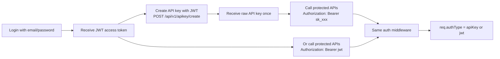

# ImageFlow Backend (ImageKit-like)

ImageFlow is an ImageKit-like backend platform for both end users and developers. It provides user-facing auth flows and media operations with JWT authentication, plus developer-friendly API key access for programmatic integrations.

Complete Express + MongoDB backend for cloud storage with user authentication flows (register, login, logout, token refresh), API key management, profile management, secure file upload, and fully documented route-based APIs for users, folders, files, and API keys.

> Note: This is ongoing and features/routes may continue to evolve.

## Tech Stack

- Node.js (ESM)
- Express 5
- MongoDB + Mongoose
- JWT (access + refresh)
- API key authentication (hashed keys)
- Redis (login attempt throttling)
- Multer (multipart handling)
- Cloudinary (file storage)
- Cookie Parser + CORS

## Current Features

- User registration with avatar upload
- Login with access/refresh token issuance
- Logout with cookie clear and refresh token unset
- Refresh access token endpoint
- Get authenticated user profile
- Update avatar
- Update password
- Update email
- Create folder
- List all folders for logged-in user
- Delete folder
- List all files in a folder
- Upload file to a folder
- Create API key (JWT only)
- List API keys (JWT only)
- Revoke API key (JWT only)

## API Base

- Base URL: http://localhost:3000
- Global prefix: /api/v1

Mounted route groups:

- /api/v1/users
- /api/v1/folders
- /api/v1/files
- /api/v1/apikey

## Authentication

Protected endpoints support both authentication methods through the same middleware:

- JWT via accessToken cookie
- JWT via Authorization: Bearer <jwt>
- API key via Authorization: Bearer sk_xxxxxx

API key management routes (/api/v1/apikey/\*) are JWT-only by design.

Token details:

- Access token signed with JWT_SECRET
- Refresh token signed with JWT_REFRESH_SECRET
- Refresh token is also checked against stored value in DB before issuing new access token
- API keys are never stored raw; only SHA256 hash is stored in the database
- API key records include prefix, revoked flag, and lastUsedAt tracking

## Architecture Diagram (Simple Flow)

Simple idea:

1. User logs in and gets JWT.
2. User creates API key using JWT.
3. Developer/coder uses that API key (or JWT) to call the same protected routes.

## Standard Response and Error Shape

Success responses use a common wrapper from responseHandler:

- statusCode
- message
- data

Error middleware returns:

- statusCode
- message
- errors (array)

## API Endpoints

### Users

| Method | Route                             | Secured | Body/Params                                                  | Notes                         |
| ------ | --------------------------------- | ------- | ------------------------------------------------------------ | ----------------------------- |
| POST   | /api/v1/users/register            | No      | multipart: fullname, username, email, password, avatar(file) | Create new user               |
| POST   | /api/v1/users/login               | No      | email, password                                              | Redis rate-limit by email+ip  |
| POST   | /api/v1/users/logout              | Yes     | none                                                         | Clears auth cookies           |
| POST   | /api/v1/users/refreshAccessToken  | No\*    | refreshToken cookie                                          | Requires valid refresh cookie |
| GET    | /api/v1/users/profile             | Yes     | none                                                         | Returns current user          |
| PATCH  | /api/v1/users/updateprofileavatar | Yes     | multipart: avatar(file)                                      | Updates avatar via Cloudinary |
| POST   | /api/v1/users/updatepassword      | Yes     | oldpassword, newpassword                                     | Changes password              |
| PATCH  | /api/v1/users/updateemail         | Yes     | newemail                                                     | Updates email if unique       |

### Folders

| Method | Route                                         | Secured | Body/Params    | Notes                               |
| ------ | --------------------------------------------- | ------- | -------------- | ----------------------------------- |
| POST   | /api/v1/folders/createfolder                  | Yes     | foldername     | Create folder for logged-in user    |
| GET    | /api/v1/folders/getalluserfolders             | Yes     | none           | List folders of current user        |
| DELETE | /api/v1/folders/deletefolder/:folderid        | Yes     | folderid param | Deletes folder and associated files |
| GET    | /api/v1/folders/getallfilesinfolder/:folderid | Yes     | folderid param | List files in folder                |

### Files

| Method | Route                               | Secured | Body/Params                          | Notes                                          |
| ------ | ----------------------------------- | ------- | ------------------------------------ | ---------------------------------------------- |
| GET    | /api/v1/files/getalluserfiles       | Yes     | query: page, limit, sortby, sorttype | List all files for logged-in user              |
| POST   | /api/v1/files/uploadfile/:folderid? | Yes     | multipart file; folderid optional    | Uploads file with or without folder assignment |

### API Keys

| Method | Route                     | Secured   | Body/Params | Notes                                                    |
| ------ | ------------------------- | --------- | ----------- | -------------------------------------------------------- |
| POST   | /api/v1/apikey/create     | Yes (JWT) | name?       | Creates API key and returns raw key only once            |
| GET    | /api/v1/apikey/list       | Yes (JWT) | none        | Lists user API keys (without keyHash)                    |
| DELETE | /api/v1/apikey/revoke/:id | Yes (JWT) | id param    | Revokes key by setting revoked=true (key is not deleted) |

Secured = requires valid authentication.
For users/folders/files routes: JWT or API key can be used.
For /api/v1/apikey routes: only JWT is accepted.
No\* = endpoint itself is public but needs a valid refresh token cookie.

## Environment Variables

Use backend/.env.example as template.

Required keys in backend/.env:

- PORT
- CORS_ORIGIN
- MONGODB_URI
- JWT_SECRET
- JWT_EXPIRES_IN
- JWT_REFRESH_SECRET
- JWT_REFRESH_EXPIRES_IN
- REDIS_HOST
- REDIS_PORT
- REDIS_PASSWORD
- cloudinary_name
- cloudinary_api_key
- cloudinary_api_secret
- RAZORPAY_KEY_ID
- RAZORPAY_KEY_SECRET
- RAZORPAY_WEBHOOK_SECRET

## Run Locally

1. Install dependencies

- From backend folder: npm install

2. Start Redis

- Option A: local Redis instance
- Option B: docker compose in backend folder:
  - docker compose up -d

3. Start API

- From backend folder: npm start

Server runs on configured PORT (current code defaults effectively to 3000 in index startup line).

## Security Implemented

- Password hashing with bcrypt in model pre-save hook
- JWT-based auth for protected routes
- Unified auth middleware supporting JWT and API keys
- HttpOnly secure cookies for tokens
- Token verification middleware for protected routes
- API keys stored as SHA256 hashes only (raw key never persisted)
- API key revocation via revoked flag
- Refresh token re-validation against stored DB token
- Login brute-force mitigation via Redis attempt counter
- Centralized error middleware
- CORS origin configuration via environment variable
- Sensitive config in environment variables

## Login Rate Limit

Rate limiting is applied to the login endpoint to reduce brute-force attempts.

- Endpoint: `POST /api/v1/users/login`
- Strategy: Redis key by `email + ip`
- Limit: 5 failed attempts
- Window: 60 seconds
- Behavior: after limit is reached, API returns `429 Too many login attempts`

Middleware path:

- `backend/src/middlewares/ratelim.middleware.js`

## Important Notes and Current Gaps

These are useful to know while integrating frontend or deploying:

- CORS is configured with origin only; credentials setting is not explicitly enabled.
- Cookie secure flag is always true, so local HTTP testing may need HTTPS/proxy adjustments.
- Multer currently has no file size/type validation configured.
- Some controller logic and naming are inconsistent (for example refresh token storage and generation flow), so additional hardening/refactor is recommended before production use.
- No automated tests are included yet.

## Folder Structure

- backend/src/app.js: app setup, middleware, route mounting
- backend/src/index.js: entry point and DB connect
- backend/src/routes: route definitions
- backend/src/controllers: request handlers
- backend/src/models: mongoose schemas
- backend/src/middlewares: auth, multer, login rate-limit
- backend/src/db: Mongo and Redis config
- backend/src/utils: async wrapper, upload helper, response/error helpers
